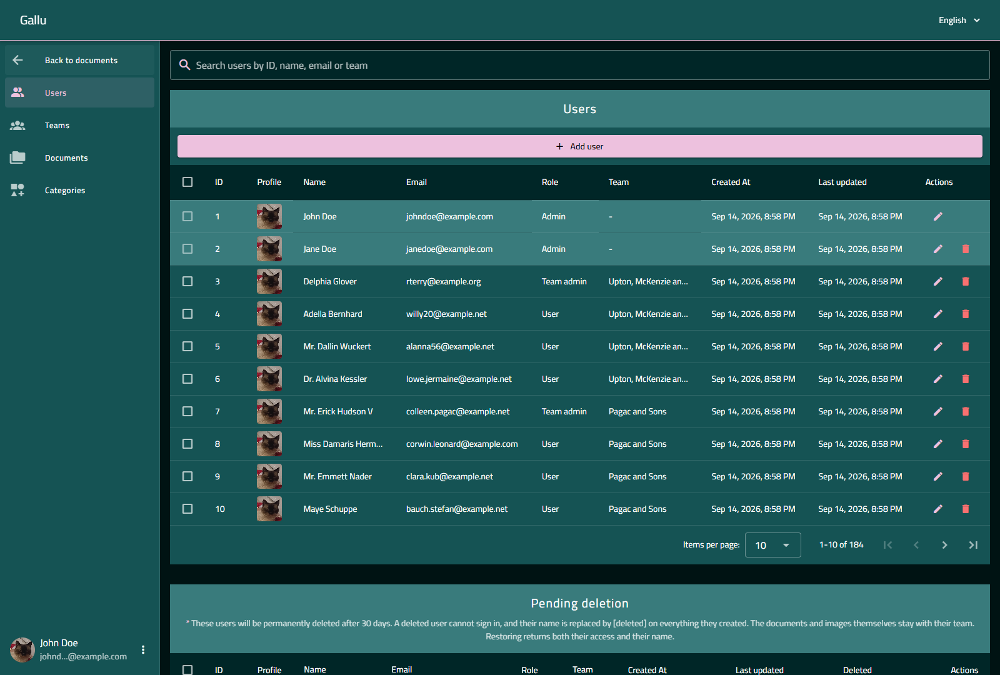
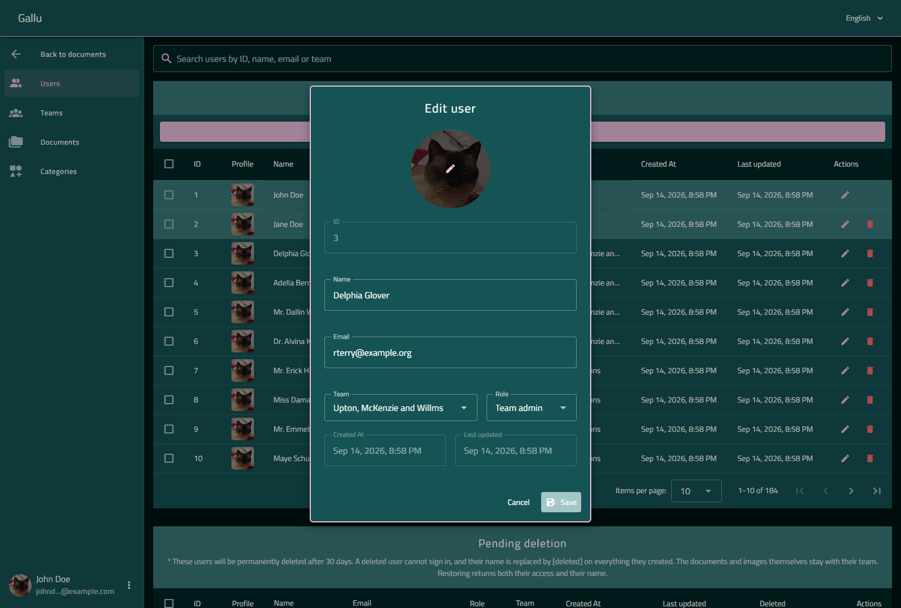
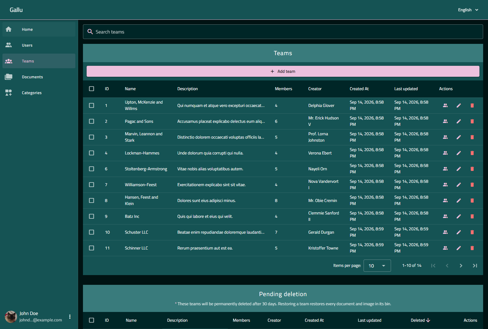
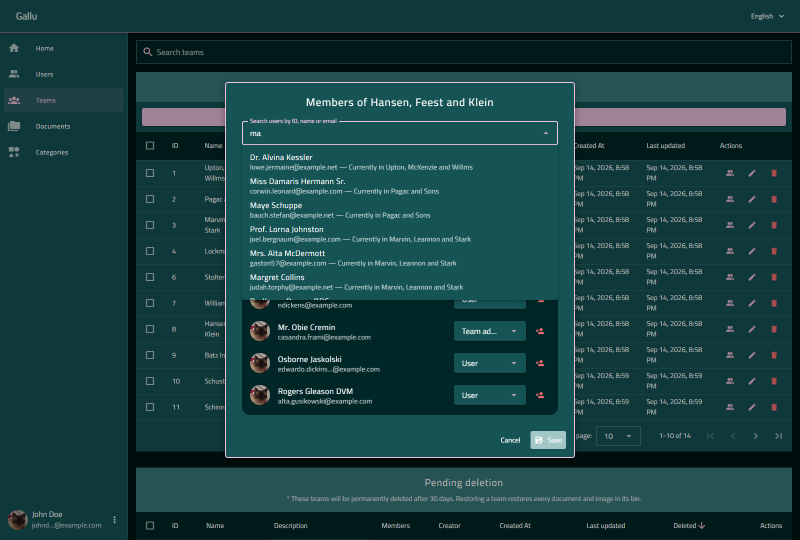
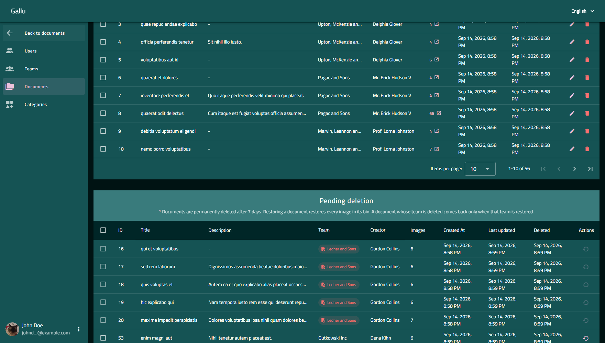
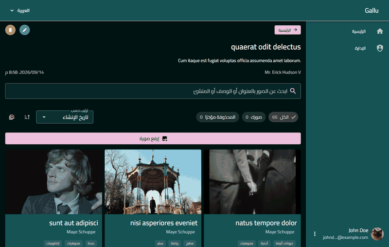
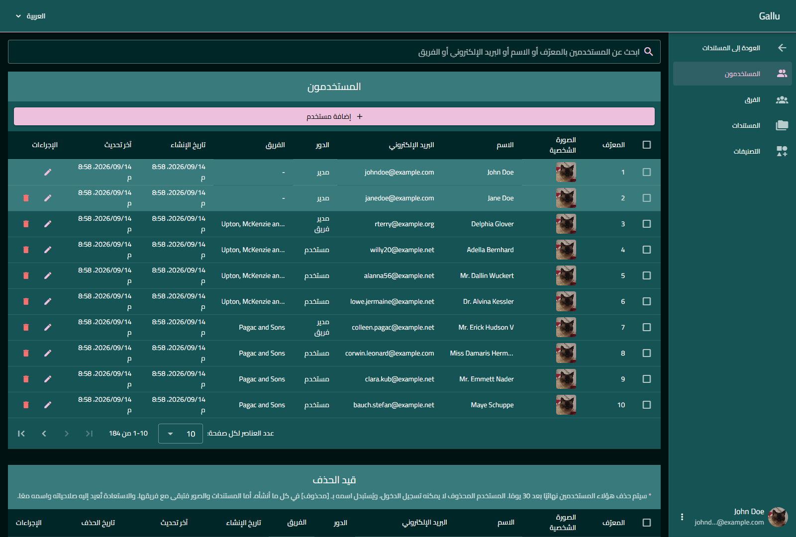

# Gallu

A multi-tenant gallery application. Teams own documents, documents hold images, and what a user
can see or touch is decided by the team they belong to and their role inside it. Nothing is ever
deleted outright — every model falls into a bin it can be restored from, and is purged only once
its retention window runs out.

A Laravel API with a separate Vue SPA, in English and Arabic, RTL included.

**Stack** — Laravel 12 · PHP 8.5 · MySQL · Pest &nbsp;|&nbsp; Vue 3 · Vuetify 4 · TypeScript · Vite · Pinia · Vitest



```
backend/    Laravel 12 REST API  — authorization, teams, media, search, retention
frontend/   Vue 3 SPA            — Vuetify UI, file-based routing, i18n (en/ar)
```

## Permissions: super-admin is a column, not a role

`admin` and `member` are real roles, seeded once with a null team so one definition serves every
team. Super-admin is a **boolean column on `users`**, because every role assignment here is scoped
to exactly one team — and a global super-admin has no team it could honestly belong to. Reserving
a "system team" id instead makes it a real row, one that shows up in team pickers and can be
renamed or deleted by the screen meant to guard it.

Authorization is then a single `Gate::before` that grants a super-admin every ability. It returns
`true` or `null` and **never `false`** — `false` there would deny every check in the app rather
than just the one. So `UserPolicy` and `TeamPolicy` have methods that all return `false`: not
stubs, but the point, since the gate already short-circuited for the only role allowed through.

The corollary: a rule that must bind super-admins *too* cannot live in a policy at all. "You may
not delete your own account" and "you may not demote yourself" are explicit controller guards —
the one place the gate cannot skip.



The SPA hides the admin nav and bounces `/admin/*` for everyone else, but that is cosmetic: route
paths ship in the JS bundle and any guard runs in the visitor's browser. The policies are what deny.

→ [The full reasoning](docs/ARCHITECTURE.md#authorization)

## Teams: membership *is* the role assignment

There is no `team_id` column on `users` and no `team_user` pivot — either would be a second source
of truth about where someone belongs. One method writes membership, and it clears existing
assignments first, which is what enforces one team per user; the underlying package would happily
hold one assignment per team. Adding someone who already belongs elsewhere is therefore a *move*,
and the members dialog says so before you commit to it. Passing no team removes them from every
team, which is what promoting someone to super-admin does.

The ambient team is set per request by middleware registered *inside* the authenticated route
group — a global prepend runs before the session starts and leaves the user null on every request.
A team-less user gets `null` rather than a sentinel id, so an unscoped write fails loudly against
the `NOT NULL` column instead of silently writing an orphan.





→ [Teams in detail](docs/ARCHITECTURE.md#teams)

## Nothing is deleted immediately

Every model soft-deletes into a bin with its own retention window, swept by a scheduled prune every
five minutes — a sweep rather than a job queued at delete time, which would still fire after a
restore and could not be re-aimed when a window changed.

| | Window |
|---|---|
| Users, teams, categories | 30 days |
| Documents | 7 days |
| Images | 24 hours |



Deletes cascade the way containers do, and a restore puts the whole container back:

- Binning a team bins its documents and their images; restoring it brings all of them back.
- A document whose team is deleted **cannot** be restored alone — its restore button is disabled
  and the UI says to restore the team first, rather than resurrect content into a team that no
  longer exists.
- **Deleting a user deliberately does not cascade.** A team is a container; an author is not. Their
  documents and images belong to the team, so binning a member costs the authorship and nothing
  else: the content stays and the UI renders `[deleted]` as its creator. Their role assignment
  survives too, which is what lets a restore return them to the same team with the same role.

One bug shaped the implementation. The force-delete cleanup used to live in the prune hook, which
only fires when the pruner reaches *that* model — so a team's cascade force-deleting its documents
went straight past it, the images were removed by SQL, the media library never heard about it, and
every file and thumbnail was orphaned on disk with nothing left to collect it. It now lives in
`deleting` hooks guarded by `isForceDeleting()`, where the invariant holds for a prune, a parent's
cascade and a manual delete alike. `PruneTrashedTest` caught it; reading the code did not.

→ [Retention, cascades and the child-clock rule](docs/ARCHITECTURE.md#soft-deletes-and-retention)

## Search

Users, documents and images go through Laravel Scout on its database engine — no index, no queue,
no re-indexing. Descriptions use a real FULLTEXT index; titles keep a `LIKE` so partial-title
search still works.

Related columns — a creator's name, a team's name — are reached through an **aliased join**, never
through Scout's engine callback. That callback appends at the *top level*, beside the engine's `OR`
group, and `AND` binds tighter than `OR`. The day users became soft-deletable, the constraint bound
to the last branch only: binned users reappeared in the live listing as soon as you searched their
name, and the trash listing returned every live user whose email matched. Found by poking at the
running app, not by the suite — two regression tests pin it now.

→ [Scout, full-text and the tie-break trap](docs/ARCHITECTURE.md#search)

## Documents, images and media

Each image owns one uploaded file with an automatic 400×400 thumbnail, and carries categories. A
document's gallery pages in as you scroll, driven by the same `meta.total` / `meta.last_page` the
admin tables use for their footers. The listing is **team-scoped rather than owner-scoped**: a
member sees their teammates' images and simply cannot edit them.



## English and Arabic

That gallery above is the Arabic UI — the app's default locale — and the whole layout mirrors, down
to the navigation drawer. The SPA sends its locale as `Accept-Language` and the API answers in it,
validation messages included.

Truncation is bidi-correct globally: one stylesheet rule resolves direction per string on every
truncating surface, which is why the Latin image titles above still align and clip from the right
end inside a right-to-left page. Without it they are cut at their *start*.



## Authentication

Session cookies, not tokens: Sanctum's stateful guard with Fortify. The auth bootstrap is awaited
*before* the router is registered, so the navigation guard decides synchronously rather than
flashing a redirect. Login is rate-limited to five attempts a minute per email and IP.

## Running it locally

**Requirements:** PHP 8.2+ (developed on 8.5), Composer, Node 20+, MySQL.

```bash
# API — http://localhost:8000
cd backend
composer setup                            # install, .env, key, migrate
php artisan storage:link                  # media URLs 404 without this
php artisan db:seed                       # 15 teams with documents, images and full bins
php artisan app:promote-super-admin you@example.com
composer dev                              # serve + queue + scheduler
```

```bash
# SPA — http://localhost:3000
cd frontend
npm install
npm run dev
```

The SPA must talk to `http://localhost:8000`, **not** a custom local domain: the session cookie has
to stay same-site.

The seeder creates two super-admins — `johndoe@example.com` and `janedoe@example.com`, password
`12345678` — and leaves something in every bin, so the retention screens have content on a fresh
install. Images are generated colour blocks unless you drop real photographs into
`backend/database/seed-images/`, which the seeder prefers when it finds any.

## Testing

```bash
cd backend  && composer test        # 400 Pest tests — needs a `gallu_test` MySQL database
cd frontend && npm run test         # 503 Vitest tests
cd frontend && npm run type-check   # vue-tsc
```

The backend suite runs on MySQL, not SQLite, which cannot create a FULLTEXT index at all — and the
full-text tests avoid `RefreshDatabase`, whose uncommitted transaction makes `MATCH … AGAINST` find
nothing a test just inserted.

## Status

Users, teams, categories, documents and images are complete, including every bin and restore path,
and every admin endpoint is behind a policy.

Why any of it is built this way: [docs/ARCHITECTURE.md](docs/ARCHITECTURE.md).
